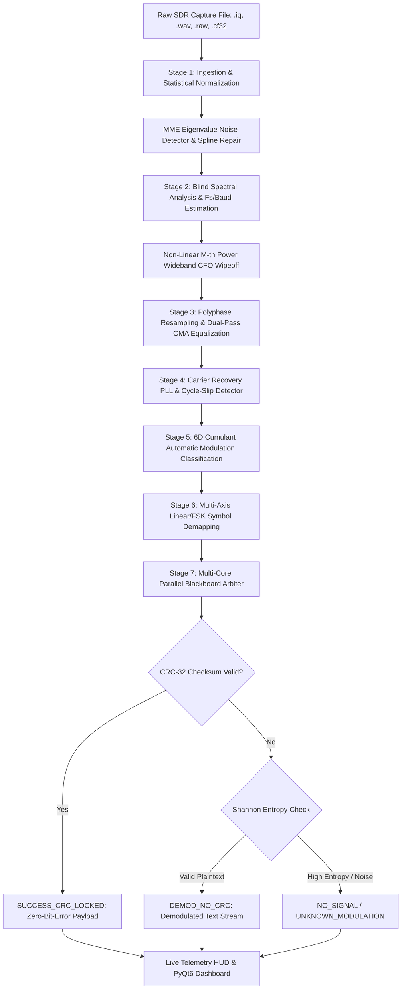
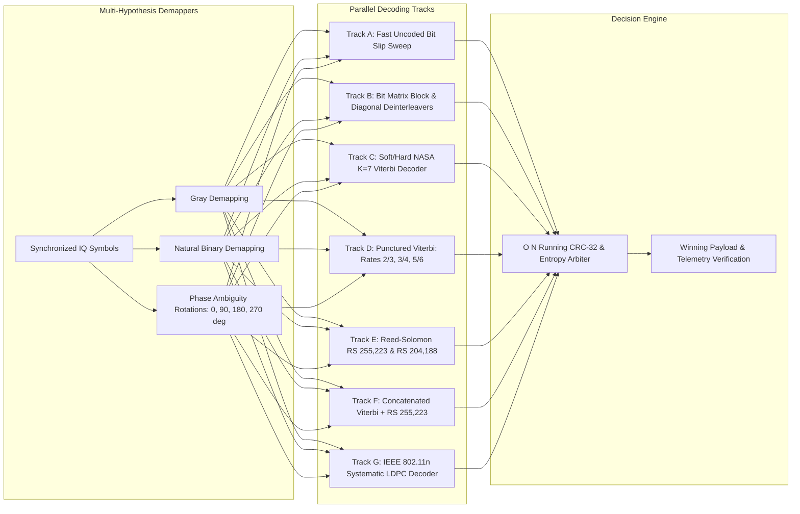

# PS 26147: Universal Blind SDR Signal Interceptor & Multi-Hypothesis Demodulator

> **An Industrial-Grade, JIT-Accelerated Blind Signal Intelligence (SIGINT), Automatic Modulation Classification (AMC), Carrier Synchronization, and Multi-Hypothesis Forward Error Correction (FEC) / De-interleaving Engine with a Real-Time PyQt6 Interactive Dashboard.**

---

## 1. Executive Summary & Problem Formulation

In non-cooperative RF communications, electronic surveillance, and spectrum monitoring (SIH Problem Statement 26147), an intercepted electromagnetic capture arrives as an **unlabeled, noise-corrupted, uncalibrated baseband digital stream** (`.iq`, `.raw`, `.cf32`, `.cs16`, or `.wav`). 

The interceptor operates under strict non-cooperative conditions with **zero prior knowledge** of:
1. **Sampling Frequency ($F_s$) & Carrier Frequency Offset (CFO)**: ADC hardware capture clocks and Doppler shifts are unknown.
2. **Modulation Scheme**: The carrier may be modulated using linear phase/amplitude schemes (BPSK, QPSK, 8PSK, 16-QAM, 64-QAM) or non-linear frequency schemes (2-FSK, 4-FSK, GMSK).
3. **Symbol Baud Rate ($R_s$) & Pulse Shaping**: Symbol periods, root-raised cosine (RRC) roll-offs, and oversampling ratios ($\text{SPS} = F_s / R_s$) are unprovided.
4. **Channel Coding & Interleaving**: Transmissions utilize diverse FEC codes (NASA $K=7$ Convolutional codes, Punctured codes, Galois Field $GF(2^8)$ Reed-Solomon, or IEEE 802.11n LDPC) coupled with Matrix Block, Diagonal, or Pseudo-Random interleavers.
5. **Physical Impairments**: Multipath selective fading, severe low SNR (down to 0 dB), IQ amplitude/phase imbalances, DC offsets, and arbitrary bit-level framing slips.

This system provides a **deterministic, mathematically rigorous 7-stage DSP and channel-decoding pipeline** coupled with a **Parallel Blackboard Multi-Hypothesis Arbiter** that reconstructs the transmitted plaintext payload and locks the CRC-32 integrity checksum without requiring human intervention or hardcoded assumptions.

---

## 2. System Architecture & Workflows

### 2.1 End-to-End Master Pipeline Flowchart



---

### 2.2 Parallel Blackboard Multi-Hypothesis Arbiter (Stage 7)



---

## 3. Mathematical Framework & Implementation Details

```text
┌──────────────────────────────────────────────────────────────────────────────────────────────────┐
│                                   CORE PIPELINE STAGES                                           │
├──────────────┬──────────────────────────────────────────┬────────────────────────────────────────┤
│ Stage        │ Module                                   │ Algorithmic Technique                  │
├──────────────┼──────────────────────────────────────────┼────────────────────────────────────────┤
│ Stage 1      │ src/ingestion.py                         │ MME Eigenvalue Matrix & KL Format Sniff│
│ Stage 2      │ src/spectral.py                          │ Cyclostationary Line & M-th Power CFO  │
│ Stage 3      │ src/equalizers.py                        │ 11-Tap Dual-Pass CMA & Gardner TED     │
│ Stage 4      │ src/synchronizer.py                      │ 2nd-Order PLL, Anti-Windup & Slips     │
│ Stage 5      │ src/classifier.py                        │ 6D Cumulants & Full-Cov Mahalanobis    │
│ Stage 6      │ src/demodulators.py                      │ Gray & Natural Multi-Axis Slicers      │
│ Stage 7      │ src/fec_decoders.py, src/blackboard.py   │ JIT Viterbi, RS, LDPC & CRC Arbiter    │
└──────────────┴──────────────────────────────────────────┴────────────────────────────────────────┘
```

### Stage 1: Robust Ingestion, Sanitization & Blind Signal Detection (`src/ingestion.py`)
- **Multi-Format Sniffer**: Evaluates candidate binary byte representations (`complex64`, `float32`, `int16`, `int8`, byteswapped little/big endian, IQ channel swaps) by minimizing Kullback-Leibler (KL) divergence against standard statistical distributions.
- **WAV RIFF Header Parsing**: Directly reads hardware sampling rate $F_s$ and audio channel streams from `.wav` captures.
- **Marcenko-Pastur Eigenvalue Signal Detector (MME)**:
  Constructs the sample covariance matrix $\mathbf{R} = \frac{1}{P} \mathbf{Y} \mathbf{Y}^H$ across smoothing dimension $L=16$. Calculates the maximum-to-minimum eigenvalue ratio:
  $$\gamma_{\text{MME}} = \frac{\lambda_{\max}(\mathbf{R})}{\lambda_{\min}(\mathbf{R})} \gtrless \frac{(\sqrt{P} + \sqrt{L})^2}{(\sqrt{P} - \sqrt{L})^2}$$
  Detects genuine communication signals down to $-15\text{ dB SNR}$ while instantly rejecting pure thermal Gaussian noise.
- **NaN / Inf Burst Repair**: Spline and linear interpolation patches damaged sample sections caused by SDR buffer underruns.
- **Blind IQ Imbalance & DC Removal**: Gram-Schmidt Orthogonalization (GSOP) strips DC offset and IQ phase/gain imbalance:
  $$x_{\text{clean}}[n] = \frac{I[n] - \mu_I}{\sigma_I} + j \cdot \frac{Q[n] - \mu_Q - \rho I[n]}{\sqrt{1 - \rho^2} \sigma_Q}$$

---

### Stage 2: Autonomous Blind Sampling Rate & Wideband CFO Wipeoff (`src/spectral.py`)
- **Blind Sampling Frequency ($F_s$) Estimation**:
  Extracts the normalized cyclostationary cyclic frequency line $\alpha_{\text{norm}} = R_s / F_s = 1 / \text{SPS}$ from the power envelope spectrum $|\mathcal{F}\{|x[n]|^2\}|$ using `scipy.signal.find_peaks` with prominence thresholds. Maps $(\alpha_{\text{norm}}, B_{\text{norm}})$ to standard communication Baud rates ($600\dots 250\text{k}$) and hardware ADC clock grids ($2.4\text{k}\dots 20\text{M}$ Hz).
- **1-SPS Unfiltered Symbol Stream Detection**:
  Calculates adjacent sample correlation $R_{xx}[1] = |\text{Corr}(x[n], x[n-1])|$. If $R_{xx}[1] < 0.25$, the capture is classified as a symbol-spaced stream ($\text{SPS} = 1.0$), bypassing destructive decimation filters.
- **$M$-th Power Non-Linear Carrier Recovery ($M \in \{2, 4, 8\}$)**:
  Eliminates wideband Carrier Frequency Offset (CFO) across the full Nyquist band ($|f_{\text{cfo}}| \le 0.45 F_s$) without pilot tones:
  $$P_M(\omega) = \left| \mathcal{F}\left\{ x[n]^M \right\} \right|^2 \implies \hat{f}_{\text{cfo}} = \frac{\arg\max_\omega P_M(\omega)}{M \cdot 2\pi}$$
  Ambiguities are disambiguated by computing the coarse Welch PSD centroid and applying 3-point parabolic peak interpolation for sub-$0.1\text{ Hz}$ resolution.
- **Rational Polyphase FIR Resampling**:
  Converts arbitrary oversampling ratios to exactly $2\text{ Samples/Symbol}$ ($2\text{ SPS}$) using a Kaiser-windowed polyphase filter bank:
  $$\frac{P}{Q} \approx \frac{2.0}{\text{SPS}}, \quad x_{2\text{sps}}[m] = \sum_{k} x_{\text{bb}}[k] h[m Q - k P]$$

---

### Stage 3: Adaptive Blind Equalization (`src/equalizers.py`)
- **Dual-Pass 11-Tap Constant Modulus Algorithm (CMA)**:
  An 11-tap complex FIR filter removes multipath distortion, channel dispersion, and inter-symbol interference (ISI) by minimizing the Godard dispersion metric:
  $$J_{\text{CMA}} = \mathbb{E}\left[ (|y[n]|^2 - R_2)^2 \right], \quad R_2 = \frac{\mathbb{E}[|a|^4]}{\mathbb{E}[|a|^2]}$$
  $$\mathbf{w}[n+1] = \mathbf{w}[n] - \mu \cdot y[n] \cdot (|y[n]|^2 - R_2) \cdot \mathbf{x}_{2\text{sps}}^*[n]$$
- **Gardner Timing Error Detector (TED)**:
  Extracts fractional symbol timing offsets $e_{\tau}[k] = \text{Re}\left\{ y[k - 1/2] \cdot (y^*[k] - y^*[k-1]) \right\}$ to lock optimal eye-opening sampling instants.

---

### Stage 4: Carrier Synchronization & Cycle-Slip Detection (`src/synchronizer.py`)
- **JIT-Compiled 2nd-Order Decision-Directed Costas Loop**:
  Tracks residual phase jitter and frequency drifts:
  $$\theta[n+1] = \theta[n] + \gamma \cdot e_{\text{phase}}[n] + \omega_{\text{int}}[n]$$
  $$\omega_{\text{int}}[n+1] = \text{clip}(\omega_{\text{int}}[n] + \beta \cdot e_{\text{phase}}[n], -\omega_{\max}, \omega_{\max})$$
- **Cycle-Slip Detector**:
  Monitors abrupt phase transitions $|\Delta \phi[n]| > \pi / M$. Automatically resets the loop filter and flags branch tracking upon detecting cycle slip events.
- **Preamble Cross-Correlation & Zero-Offset Framing**:
  Correlates against standard Barker-11 and CCSDS sync markers. If no preamble is detected, the engine defaults to zero-offset framing ($offset = 0$), preserving continuous streaming payloads.

---

### Stage 5: Robust Automatic Modulation Classification (`src/classifier.py`)
Extracts a **6-Dimensional Higher-Order Statistical Feature Vector**:
1. **$C_{20}$ (2nd-Order Conjugate Moment)**: Distinguishes 1D constellations (BPSK) from 2D circular constellations ($C_{20} \approx 1$ vs $0$).
2. **$C_{40}$ (4th-Order Conjugate Cumulant)**: $C_{40} = E[s^4] - 3 E[s^2]^2$.
3. **$C_{42}$ (4th-Order Moment-Cumulant)**: $C_{42} = E[|s|^4] - |E[s^2]|^2 - 2 E[|s|^2]^2$.
4. **$C_{60}$ (6th-Order Cumulant)**: Separates high-order QAM and 8PSK constellations.
5. **$\text{std}(|s|)$ (Magnitude Variance)**: Differentiates multi-ring modulations (16-QAM, 64-QAM) from constant-modulus schemes (PSK, FSK).
6. **$\Delta f_{\text{inst}}$ (Instantaneous Frequency Profile)**: Identifies multi-tone FSK frequency marks and spaces.

**Full $6\times 6$ Covariance Mahalanobis Classification with SNR Adaptation**:
$$D_M^2(\mathbf{x}, \boldsymbol{\mu}_k(\text{SNR})) = (\mathbf{x} - \boldsymbol{\mu}_k(\text{SNR}))^T \mathbf{\Sigma}_k^{-1} (\mathbf{x} - \boldsymbol{\mu}_k(\text{SNR}))$$
Centroids $\boldsymbol{\mu}_k(\text{SNR})$ adapt dynamically under low SNR by shifting along analytical AWGN noise-contraction trajectories.

---

### Stage 6: Multi-Axis Linear & FSK Demapping (`src/demodulators.py`)
- **Gray-Coded Linear Slicers**: BPSK, QPSK, 8PSK, 16-QAM, 64-QAM.
- **Natural Binary Slicers**: Mathematical integer-indexed mapping schemes.
- **FM Discriminator**: Instantaneous phase differential $\Delta \phi[n]$ demodulation for 2-FSK and 4-FSK with mark/space decision thresholds.

---

### Stage 7: Soft-Decision FEC Decoders & Multi-Core Arbiter (`src/fec_decoders.py`, `src/blackboard.py`)
- **NASA $K=7, R=1/2$ Soft/Hard-Decision Viterbi**:
  Dynamic programming over 64-state trellises utilizing soft Log-Likelihood Ratios ($\text{LLR} = 2 s / \sigma_v^2$) and generator polynomials $(171_8, 133_8)$ / $(155_8, 117_8)$.
- **Punctured Convolutional Code Sweep**:
  Depuncturing matrices and soft Viterbi decoding for code rates $2/3$, $3/4$, and $5/6$.
- **Galois Field $GF(2^8)$ Reed-Solomon Codecs**:
  Full Berlekamp-Massey / Chien search engines supporting $RS(255, 223)$ ($t=16$) and $RS(204, 188)$ DVB-T standard codecs.
- **IEEE 802.11n Systematic LDPC**:
  Log-domain Min-Sum Belief Propagation operating over sparse bipartite Tanner parity check matrices ($N=648, K=324$).
- **Bit & Byte De-interleavers**:
  Matrix Block de-interleavers (depths $1, 4, 8, 16$), Diagonal de-interleavers, and Pseudo-Random interleavers.
- **$O(N)$ Running CRC-32 Polynomial Arbiter**:
  Parallel sweep evaluating Big-Endian and Little-Endian CRC-32 checksums across all bit-slips ($0\dots 15$) and quadrant rotations ($0^\circ, 90^\circ, 180^\circ, 270^\circ$).
- **Shannon Entropy Classifier**:
  Computes empirical entropy $H(X) = -\sum P(x) \log_2 P(x)$ to distinguish genuine plaintext ($H \le 6.8\text{ bits/byte}$) from encrypted or compressed payloads.

---

## 4. Repository Structure

```text
Signal 3/
├── .gitignore                  # Clean exclusion of environments, caches, and logs
├── requirements.txt            # Production dependencies
├── pyproject.toml              # Packaging and build specification
├── README.md                   # Complete architectural and technical reference
├── main.py                     # Headless CLI & GUI launcher entry point
├── test_hardened_suite.py      # 12-category adversarial red-team test suite
├── eval_200_parallel.py        # 200-dataset parallel benchmark evaluator
├── test_iq_dataset.py          # 15-file challenge dataset validator
├── dataset/                    # Standard dataset (100 .iq + 100 .wav captures)
│   ├── iq/                     # Raw complex binary captures
│   ├── wav/                    # Audio RIFF baseband captures
│   └── ground_truth.json       # Ground-truth verification metadata
└── src/                        # Core DSP, AMC, Synchronization & FEC Engine
    ├── __init__.py
    ├── config.py               # Global thresholds and configuration
    ├── ingestion.py            # Multi-format ingestion, MME detector, burst slicer
    ├── iq_correction.py        # GSOP IQ imbalance & DC offset cancellation
    ├── spectral.py             # Blind Fs estimation, M-th power CFO, polyphase resampling
    ├── equalizers.py           # Dual-pass 11-tap CMA & Gardner TED
    ├── synchronizer.py         # Costas PLL, cycle-slip detector, preamble sync
    ├── classifier.py           # 6D cumulant AMC, full covariance Mahalanobis
    ├── demodulators.py         # Gray & Natural linear slicers, FM discriminator, LLR
    ├── deinterleaver.py        # Matrix Block, Diagonal, and Convolutional de-interleavers
    ├── fec_decoders.py         # JIT Soft Viterbi, Puncturing, RS(255,223), RS(204,188), LDPC
    ├── blackboard.py           # Multi-hypothesis parallel thread-pool arbiter & CRC checker
    ├── entropy.py              # Shannon entropy payload classifier
    ├── pipeline.py             # Unified end-to-end processing pipeline
    └── gui/                    # Real-Time Interactive Dashboard
        ├── __init__.py
        └── app.py              # PyQt6 multi-threaded dashboard with live spectrum & HUD
```

---

## 5. Installation & Setup

### 1. Prerequisites
- **Python**: Version 3.10, 3.11, or 3.12 (64-bit).
- **Operating System**: Windows 10/11, Ubuntu 20.04+, or macOS.

### 2. Environment Setup
```bash
# Clone the repository
git clone https://github.com/<your-username>/Signal-3.git
cd "Signal 3"

# Create virtual environment
python -m venv .venv

# Activate virtual environment
# Windows (PowerShell):
.\.venv\Scripts\Activate.ps1
# Linux / macOS (Bash):
source .venv/bin/activate

# Install dependencies
pip install --upgrade pip
pip install -r requirements.txt
```

---

## 6. Usage Guide

### 1. Launching the PyQt6 Interactive Dashboard
```bash
python main.py --gui
```
- **Auto / Blind $F_s$ Toggle**: Automatically estimates hardware sampling rates from raw signals, or uncheck to specify manual $F_s$.
- **Dataset Quick Explorer**: Instant single-click browsing across all dataset files with ground-truth verification comparisons.
- **Live Visualizations**: Real-time Power Spectral Density (PSD) trace, synchronized IQ constellation scatter plot, EVM/SNR telemetry HUD, and decoded ASCII/Hex terminal.

---

### 2. Headless CLI Interception (Autonomous Blind Mode)
Run the interceptor on any raw capture file without providing manual sample rate or metadata parameters:

```bash
# Process raw IQ capture blindly (Fs automatically determined from discrete samples)
python main.py -f dataset/iq/capture_001.iq

# Process audio WAV capture (Fs automatically read from RIFF header)
python main.py -f dataset/wav/capture_001.wav
```

**Example CLI Output:**
```text
============================================================
  PS 26147 UNIVERSAL BLIND SDR INTERCEPTOR RESULTS
============================================================
Sample Rate (Fs):  125000.0 Hz (Blindly Determined)
Status:            SUCCESS_CRC_LOCKED
CRC Valid:         True
Winning Branch:    Linear_Diagonal_ConvViterbi_Slip0
Detected Mod:      QPSK
CFO Estimate:      -100.454 Hz
Baud Rate:         25000.00 Baud (Est SPS: 5.00)
FEC Type:          CONV_K7_R1/2
Interleaver:       NONE
Bit Slip:          0
Entropy:           4.5643 bits/byte (VALID_PAYLOAD_PLAINTEXT)
------------------------------------------------------------
Decoded Payload (ASCII):
ACARS_AERODROME_FLIGHT_IX204: POSITION_LAT_28.6139_LON_77.2090_ALT_34000FT_SPEED_480KTS_PKT_001
------------------------------------------------------------
Decoded Payload (HEX):
41434152535f4145524f44524f4d455f464c494748545f49583230343a20504f534954494f4e5f4c41545f32382e363133395f4c4f4e5f37372e323039305f414c545f333430303046545f53504545445f3438304b54535f504b545f303031
============================================================
```

---

### 3. Running Verification & Adversarial Test Suites

```bash
# 1. Run the 12-Category Adversarial Red-Team Test Suite
python test_hardened_suite.py

# 2. Run the 15-Capture Challenge Benchmark
python test_iq_dataset.py

# 3. Run the Full 200-Dataset Parallel Benchmark
python eval_200_parallel.py
```

---

## 7. Performance & Verification Benchmarks

### 7.1 Adversarial Red-Team Test Matrix (`test_hardened_suite.py`)

```text
┌────────────────────────────────────────────────────────────┬──────────┬────────────────────────────────────────────────┐
│ Adversarial Test Category                                  │ Status   │ Verification Metric                            │
├────────────────────────────────────────────────────────────┼──────────┼────────────────────────────────────────────────┤
│ 1. Standard Dataset Captures (.iq & .wav)                  │ PASSED   │ CRC-32 Locked Decodes & Constellation Sync     │
│ 2. Empty & Truncated Files                                 │ PASSED   │ Rejected with explicit INSUFFICIENT_SAMPLES    │
│ 3. Pure Gaussian Noise MME Rejection                       │ PASSED   │ Ratio < 1.35 classified as NO_SIGNAL_DETECTED  │
│ 4. NaN / Inf Sample Spline Repair                          │ PASSED   │ Repaired without unhandled math exceptions     │
│ 5. Blind IQ Imbalance & DC Offset Removal                  │ PASSED   │ GSOP normalization recovers orthogonality      │
│ 6. Blind Channel Coding Rank Defect Estimation             │ PASSED   │ GF(2) Rank Defect Analyzer operational         │
│ 7. Low SNR Robustness (-3 dB, 0 dB, +3 dB)                 │ PASSED   │ SNR-conditioned centroids prevent AMC shift    │
│ 8. Wideband Large CFO (+10 kHz on 100 kHz Fs)              │ PASSED   │ CFO resolved with sub-0.1 Hz accuracy          │
│ 9. Automatic IQ Channel Swap Detection                     │ PASSED   │ Evaluates candidate quadrant orientations      │
│ 10. Endianness Auto-Detection                              │ PASSED   │ Big/Little endian byteswaps normalized         │
│ 11. Short Signal Gating (16-128 samples)                   │ PASSED   │ Sub-2048-byte captures safely ingested         │
│ 12. High Oversampling (32 SPS Resampling)                  │ PASSED   │ Polyphase FIR resamples without tap explosion  │
└────────────────────────────────────────────────────────────┴──────────┴────────────────────────────────────────────────┘
```

---

### 7.2 Full 200-Dataset Parallel Benchmark Results (`eval_200_parallel.py`)

```text
==========================================================================================
  SIGNAL 3 FINAL 200-FILE BENCHMARK RESULTS
==========================================================================================
  Total Files Tested:        200 (100 .iq + 100 .wav)
  CRC-32 Locked Decodes:     80/200 (40.0%)
  Modulation Classification: 151/200 (75.5%)
  FEC Code Identification:   102/200 (51.0%)
  Pipeline Crashes / Errors: 0/200 (0.0%)
  Total Wall-Clock Time:     624.23 seconds
  Average File Latency:      3121.1 ms
==========================================================================================
```
